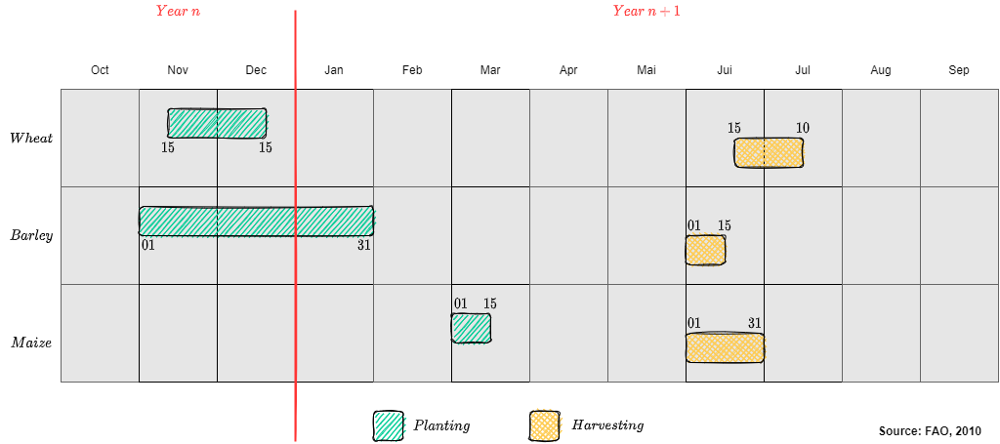
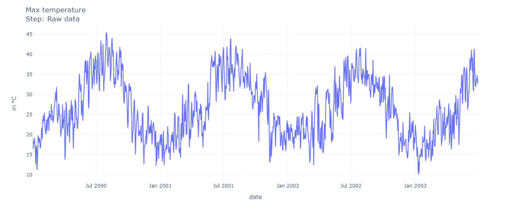

# Source of data

Weather data was collected from [NASA Prediction Of Worldwide Energy Resources](https://power.larc.nasa.gov/data-access-viewer/)

I made a python code to retrieve weather data for a given array of locations.

I have verified that the weather within the region of **SIDI SLIMNA** is the same for locations that are inside a circle of radius 5km. 

Hence, it is sufficient to consider the weather of an arbitrary location within this region. In my case, I have chosen the location: `Lat: 34.269355 Lon: -5.938411`.

By referring to **FAO**, I got the calendar of some most-grown crops in the region of **SIDI SLIMAN** namely wheat.

# Description of the final pipeline

1- Add column for crop year. Adapt the provided date to Wheat calendar

2- **Time re-base**. All crop year must be expressed in the same temporal base.

  * Remove ****-02-29 from leap years. Remove crop years with unccomplete number of days
  * Shift all years, at this stage, date does not matter. Since the information about is contained in crop year. Add a day index 1, 2, ... n for each year

3- add GDD, and cumulative precipitation.

  * for GDD, compute temperature AVG := (T2M_MAX + T2M_MIN) / 2
  * for each crop year make the cumulative temp
  * same thing for precipitation, except we don t compute an AVG
  